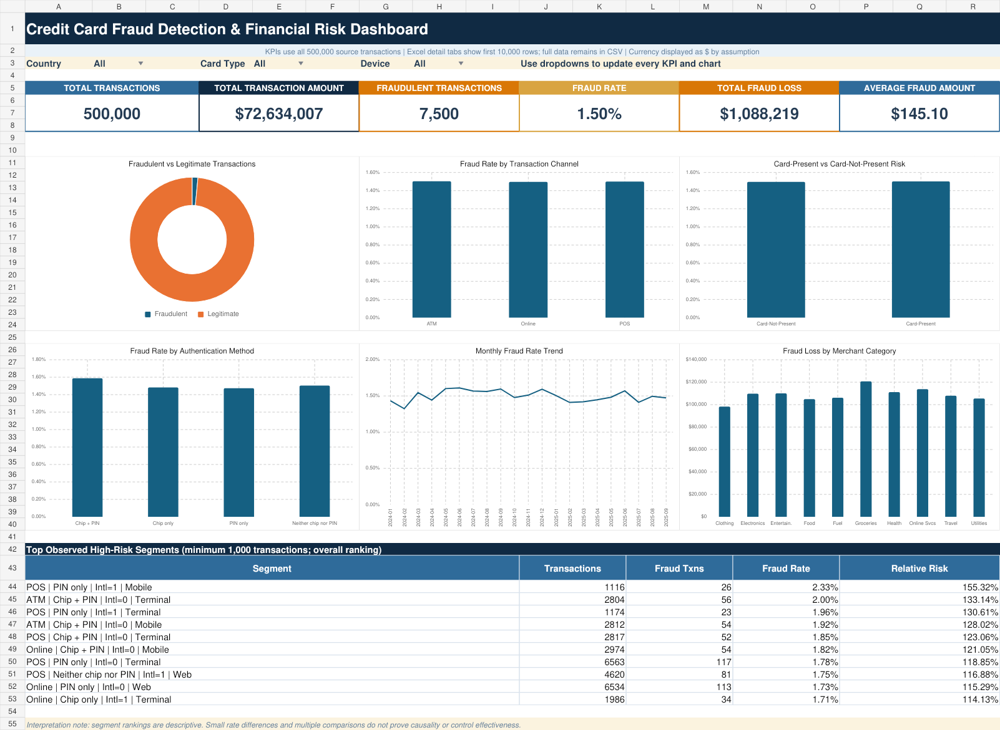

# Credit Card Fraud Detection & Financial Risk Analytics


## Project overview

This project analyzes 500,000 credit card transactions to measure fraud exposure, compare risk across transaction channels and authentication signals, identify suspicious patterns, and provide a polished Excel monitoring dashboard. All reported figures are computed from the supplied CSV; no analytical result is invented.

## Business problem

Fraud teams need a reliable view of transaction volume, fraud rate, financial exposure, and segment-level variation. The project answers:

- How many transactions are fraudulent and how much value is exposed?
- Do channel, card presence, authentication, country, device, or category show higher observed fraud risk?
- How does fraud change by month, week, and hour?
- Which high-value or unusual patterns deserve operational review?

## Dataset description

- **Source file:** `data/raw/credit_card_fraud_2025.csv`
- **Grain:** one row per transaction (`Transaction_ID` is unique)
- **Rows:** 500,000
- **Original columns:** 16
- **Coverage:** 1 January 2024 00:01 through 29 September 2025 23:57
- **Fraud label:** `Fraud_Flag` (`1` = fraudulent, `0` = legitimate)
- **Quality:** 0 missing cells, 0 exact duplicate rows, 0 duplicate transaction IDs, 0 invalid dates, 0 non-positive amounts, and 0 timestamp/hour mismatches

The dataset does not include a separate authentication-method column. The analysis derives authentication from `Is_Chip` and `Is_Pin_Used`. It also defines `Online` as card-not-present and `POS`/`ATM` as card-present. These are documented analytical definitions, not original fields.

## Tools and technologies

- **Python:** Pandas, NumPy, Matplotlib, Seaborn, Plotly-ready exports
- **SQL:** SQLite, including CTEs, subqueries, `CASE WHEN`, `HAVING`, and window functions
- **Excel:** formula-driven KPIs, analysis tables, dropdown filters, conditional formatting, and native charts
- **Development:** VS Code, Jupyter Notebook, Git, GitHub

## Data-cleaning process

1. Standardize column names and trim categorical text.
2. Convert IDs, amount, distance, hour, and flags to numeric data types.
3. Parse `Transaction_Date` with the actual `DD-MM-YYYY HH:MM` format.
4. Validate required columns, binary flags, positive amounts, non-negative distance, and hour range.
5. Remove invalid rows, exact duplicates, and duplicated transaction IDs if found.
6. Derive card presence, authentication method, month, week start, day of week, fraud amount, high-value, distance, and off-hours flags.

The supplied file passed every material cleaning rule, so all 500,000 rows remain after cleaning.

## KPI definitions and verified values

| KPI                      | Formula                                   | Verified value |
| ------------------------ | ----------------------------------------- | -------------: |
| Total Transactions       | Count of transaction rows                 |        500,000 |
| Fraudulent Transactions  | Sum of`Fraud_Flag`                      |          7,500 |
| Legitimate Transactions  | Total - fraudulent                        |        492,500 |
| Fraud Rate               | Fraudulent / total                        |          1.50% |
| Total Transaction Amount | Sum of`Amount`                          | $72,634,006.83 |
| Total Fraud Loss         | Sum of`Amount` where `Fraud_Flag = 1` |  $1,088,218.66 |
| Average Fraud Amount     | Fraud loss / fraudulent transactions      |        $145.10 |

### Resume-figure verification

- `500K+ transactions`: the dataset contains **exactly 500,000**, so use “500,000 transactions” for maximum precision.
- `1.50% fraud rate`: **verified exactly** (`7,500 / 500,000`).
- `$1.09M fraud losses`: **verified as a rounded figure** from `$1,088,218.66`.

## Key findings

- Transaction-channel fraud rates are nearly flat: ATM **1.5028%**, POS **1.5004%**, and Online **1.4968%**. The file does not support a strong claim that one channel is materially riskier.
- Card-present transactions show a **1.5016%** observed fraud rate versus **1.4968%** for card-not-present transactions—a difference of only **0.0048 percentage points**.
- `Chip + PIN` has the highest observed authentication-group rate at **1.5884%**, but this counterintuitive result should not be interpreted causally; the four groups remain close to the 1.50% baseline.
- Germany has the highest observed country fraud rate at **1.5956%**; Singapore has the largest fraud loss at **$143,693.70**.
- Travel has the highest merchant-category fraud rate at **1.5578%**; Groceries has the largest category fraud loss at **$120,712.02**.
- The top 1% of transactions by amount begins at **$579.53** and has an observed fraud rate of **1.8196%**. This is a descriptive signal, not proof of predictive lift.
- Segment rates are tightly clustered and several variables are almost uniformly distributed. Without provenance, the data may be simulated or randomized; use rankings as portfolio descriptions rather than real-world control effectiveness claims.

## Dashboard preview



The dashboard includes six headline KPIs, country/card/device dropdown filters, fraud composition, channel and card-presence comparisons, authentication risk, monthly trends, category losses, and a high-risk segment table.

## Project folder structure

```text
credit-card-fraud-risk-analytics/
├── data/
│   ├── raw/
│   ├── processed/
│   └── exports/
├── notebooks/
│   └── fraud_risk_analysis.ipynb
├── python/
│   ├── fraud_analysis.py
│   ├── create_notebook.py
│   └── load_sqlite.py
├── sql/
│   └── fraud_analysis_sqlite.sql
├── excel_dashboard/
│   └── Credit_Card_Fraud_Risk_Dashboard.xlsx
├── images/
├── requirements.txt
├── VALIDATION.md
├── README.md
└── .gitignore
```

## Step-by-step execution in VS Code

1. Install [Python 3.10 or newer](https://www.python.org/downloads/) and [VS Code](https://code.visualstudio.com/).
2. Open this project folder in VS Code: **File → Open Folder**.
3. Open **Terminal → New Terminal**.
4. Create a virtual environment:

   ```bash
   python -m venv .venv
   ```
5. Activate it on Windows PowerShell:

   ```powershell
   .\.venv\Scripts\Activate.ps1
   ```
6. Install dependencies:

   ```bash
   pip install -r requirements.txt
   ```
7. Run the full Python analysis:

   ```bash
   python python/fraud_analysis.py
   ```
8. Optional: open `notebooks/fraud_risk_analysis.ipynb`, select the virtual-environment kernel, and click **Run All**.

Generated tables appear in `data/exports/`; cleaned data appears in `data/processed/`; charts appear in `images/`.

## SQL execution instructions

1. Generate the cleaned CSV as shown above.
2. Build the SQLite database:

   ```bash
   python python/load_sqlite.py
   ```
3. Open SQLite and run the queries:

   ```bash
   sqlite3 data/fraud_analytics.db
   .read sql/fraud_analysis_sqlite.sql
   ```

If the `sqlite3` command is unavailable, install [DB Browser for SQLite](https://sqlitebrowser.org/), open `data/fraud_analytics.db`, paste individual queries from the SQL file into **Execute SQL**, and run them.

## Excel dashboard usage

1. Open `excel_dashboard/Credit_Card_Fraud_Risk_Dashboard.xlsx` in desktop Microsoft Excel.
2. Use the dropdown filters near the top of `Dashboard` to select Country, Card Type, or Device Type.
3. KPI cards and chart-driving analysis use compact aggregates calculated from all 500,000 rows.
4. Use table filter arrows on `Raw_Data` and `Cleaned_Data` for row-level inspection. To keep Excel responsive, these tabs contain the first 10,000 rows; the complete raw and cleaned CSV files remain in `data/`.
5. Review metric definitions and assumptions in `Data_Dictionary` before presenting findings.

## Resume-ready project description

**Credit Card Fraud Detection & Financial Risk Analytics | Python, SQL, Excel**

- Analyzed **500,000** credit card transactions using Python and SQL, validating a **1.50% fraud rate**, **7,500 fraudulent transactions**, and **$1.09M** in fraud exposure through reproducible quality checks and segment analysis.
- Built an interactive Excel fraud-monitoring dashboard with formula-driven KPIs, filters, conditional formatting, and charts comparing channel, card-presence, authentication, geographic, temporal, and merchant-category risk.

## Safe interview talking points

- **Dataset finding:** exactly 500,000 transactions, including 7,500 fraud observations.
- **Dataset finding:** fraud rate is 1.50%; total fraud-labeled amount is $1,088,218.66.
- **Dataset finding:** total transaction value is $72.63M; average fraudulent amount is $145.10.
- **Dataset finding:** observed channel and card-presence rate differences are very small.
- **Analytical definition:** Online is treated as card-not-present; POS and ATM as card-present.
- **Assumption:** `$` is used for presentation because the resume statement used dollars; the CSV has no currency column.

## Limitations and future improvements

- Dataset provenance, currency, cardholder demographics, fraud-confirmation timing, chargeback recovery, and merchant geography are unavailable.
- `Fraud_Flag` is analyzed as the ground-truth label, but no label-quality audit is possible from this file alone.
- Segment comparisons are descriptive and do not prove causality or control effectiveness.
- The 1.50% label rate and near-uniform segment distributions may reflect simulated data.
- Future work: add train/test fraud models, precision-recall evaluation, class-imbalance handling, drift monitoring, explainability, real chargeback costs, and a live database/BI refresh pipeline.
